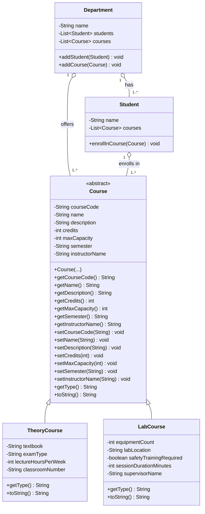
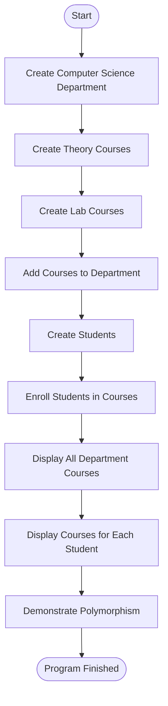

# University Department  Management System

A Java Maven console application that demonstrates core Object-Oriented Programming (OOP) concepts through a university course management scenario.

The system models a university department, different types of courses, and students enrolled in those courses. It demonstrates abstraction, inheritance, polymorphism, constructor chaining, and object relationships using Java collections.

---

## Overview

The application represents a university department that offers multiple types of courses:

- **Theory Courses**
- **Lab Courses**

A common abstract `Course` class defines the shared course information and behavior, while `TheoryCourse` and `LabCourse` provide specialized implementations.

Students can enroll in different course types, and the department maintains collections of both students and courses.

The application provides a simple console-based demonstration of the complete scenario.

---

## Features

- Create a university department
- Add multiple courses to a department
- Support Theory and Lab course types
- Create multiple students
- Enroll students in different course types
- Store different course types using `List<Course>`
- Demonstrate runtime polymorphism
- Use constructor chaining with `super(...)`
- Override `toString()` in child classes
- Display all courses offered by the department
- Display courses enrolled by each student
- Demonstrate dynamic `getType()` behavior

---

## System Architecture

The project follows the object-oriented structure defined by the assignment.



---

## Class Structure

### Course

`Course` is the abstract base class for all course types.

It contains the common information shared by every course.

### Common Attributes

| Attribute | Type | Description |
|---|---|---|
| `courseCode` | `String` | Unique course identifier |
| `name` | `String` | Course name |
| `description` | `String` | Course description |
| `credits` | `int` | Number of course credits |
| `maxCapacity` | `int` | Maximum number of students |
| `semester` | `String` | Course semester |
| `instructorName` | `String` | Course instructor |

### Main Method

```java
public abstract String getType();
```

The method is implemented differently by the concrete course classes.

---

## TheoryCourse

`TheoryCourse` extends the abstract `Course` class and represents theoretical academic courses.

Example course:

```text
CS201 - Data Structures
```

Example output:

```text
TheoryCourse{
    courseCode=CS201,
    name=Data Structures,
    textbook=Introduction to Algorithms,
    examType=Written,
    lectureHoursPerWeek=3,
    classroomNumber=C-101
}
```

### Example Category

```text
Theory
```

---

## LabCourse

`LabCourse` extends the abstract `Course` class and represents practical laboratory courses.

Example course:

```text
CS210 - Programming Lab
```

Example output:

```text
LabCourse{
    courseCode=CS210,
    name=Programming Lab,
    equipmentCount=30,
    labLocation=Building B, Room 1,
    safetyTrainingRequired=true,
    sessionDurationMinutes=90,
    supervisorName=Eng. Yousef Sami
}
```

### Example Category

```text
Lab
```

---

# Object-Oriented Design

The project demonstrates several fundamental OOP principles.

## 1. Abstraction

`Course` is declared as an abstract class.

```java
public abstract class Course
```

This prevents direct creation of generic `Course` objects and provides a common structure for all course types.

```text
Course
   │
   ├── TheoryCourse
   │
   └── LabCourse
```

---

## 2. Inheritance

Both concrete course types inherit from `Course`.

```text
TheoryCourse → Course
LabCourse    → Course
```

This allows common course information and behavior to be defined once in the parent class.

---

## 3. Polymorphism

The project demonstrates polymorphism by storing different course objects using the common parent type:

```java
List<Course>
```

For example:

```java
List<Course> courses = new ArrayList<>();

courses.add(new TheoryCourse(...));
courses.add(new LabCourse(...));
```

Although the collection contains `Course` references, Java determines the actual implementation at runtime.

For example:

```java
course.getType();
```

can return:

```text
Theory
```

or:

```text
Lab
```

depending on the actual object.

---

## 4. Constructor Chaining

The child classes use constructor chaining to initialize the inherited `Course` attributes.

Conceptually:

```java
public TheoryCourse(...) {
    super(courseCode, name, description, credits,
          maxCapacity, semester, instructorName);

    // Initialize TheoryCourse-specific attributes
}
```

The same approach is used by `LabCourse`.

This allows the parent class to initialize its own state while the child class initializes its specialized attributes.

---

## 5. Method Overriding

Both concrete course classes override:

```java
getType()
```

and:

```java
toString()
```

This allows each course type to provide its own behavior and representation.

---

# Department and Student Relationships

The system models relationships between:

```text
Department
    │
    ├── Students
    │
    └── Courses

Student
    │
    └── Enrolled Courses
```

A department can contain multiple students and multiple courses.

A student can enroll in different types of courses.

Because students work with `Course` references, they can enroll in both:

```text
TheoryCourse
LabCourse
```

without requiring separate enrollment logic.

---

# Application Flow



---

# Console Application

The application is implemented as a console-based Java application.

The main execution flow displays the following stages:

```text
======================================================================
  UNIVERSITY COURSE MANAGEMENT SYSTEM
======================================================================
1) Creating the Computer Science department...
2) Creating Theory and Lab courses...
3) Creating students...
4) Enrolling students in different course types...
```

---

# Courses Offered

The sample application creates four courses:

### Theory Courses

```text
CS201 - Data Structures
CS305 - Database Systems
```

### Lab Courses

```text
CS210 - Programming Lab
CS310 - Networking Lab
```

The department displays all four courses using their overridden `toString()` implementations.

---

# Student Enrollments

The sample application creates two students:

```text
Ahmed
Sara
```

### Ahmed

Ahmed is enrolled in:

```text
CS201 - Data Structures
CS310 - Networking Lab
```

### Sara

Sara is enrolled in:

```text
CS210 - Programming Lab
CS305 - Database Systems
```

This demonstrates that a student can enroll in different course types through the common `Course` abstraction.

---

# Polymorphism Demonstration

The application explicitly demonstrates runtime polymorphism.

The courses are handled through `Course` references while the correct implementation of `getType()` is selected at runtime.

Example output:

```text
======================================================================
  POLYMORPHISM DEMONSTRATION
======================================================================

The following objects are stored as Course references,
but Java calls the correct getType() implementation at runtime:

- CS201 | Data Structures --> Theory
- CS305 | Database Systems --> Theory
- CS210 | Programming Lab --> Lab
- CS310 | Networking Lab --> Lab
```

This demonstrates the key OOP concept of:

```text
One Parent Type
      ↓
Multiple Child Types
      ↓
Different Runtime Behavior
```

---

# Sample Output

```text
======================================================================
  UNIVERSITY COURSE MANAGEMENT SYSTEM
======================================================================

1) Creating the Computer Science department...
2) Creating Theory and Lab courses...
3) Creating students...
4) Enrolling students in different course types...

======================================================================
  ALL COURSES OFFERED BY THE DEPARTMENT
======================================================================

Department: Computer Science - Courses offered:

  - TheoryCourse{
      courseCode=CS201,
      name=Data Structures,
      textbook=Introduction to Algorithms,
      examType=Written,
      lectureHoursPerWeek=3,
      classroomNumber=C-101
    }

  - TheoryCourse{
      courseCode=CS305,
      name=Database Systems,
      textbook=Database System Concepts,
      examType=Written,
      lectureHoursPerWeek=3,
      classroomNumber=C-102
    }

  - LabCourse{
      courseCode=CS210,
      name=Programming Lab,
      equipmentCount=30,
      labLocation=Building B, Room 1,
      safetyTrainingRequired=true,
      sessionDurationMinutes=90,
      supervisorName=Eng. Yousef Sami
    }

  - LabCourse{
      courseCode=CS310,
      name=Networking Lab,
      equipmentCount=15,
      labLocation=Building B, Room 3,
      safetyTrainingRequired=true,
      sessionDurationMinutes=120,
      supervisorName=Eng. Mona Adel
    }
```

---

# Student Courses

```text
======================================================================
  COURSES ENROLLED BY EACH STUDENT
======================================================================

Student: Ahmed

  - TheoryCourse{
      courseCode=CS201,
      name=Data Structures,
      ...
    }

  - LabCourse{
      courseCode=CS310,
      name=Networking Lab,
      ...
    }


Student: Sara

  - LabCourse{
      courseCode=CS210,
      name=Programming Lab,
      ...
    }

  - TheoryCourse{
      courseCode=CS305,
      name=Database Systems,
      ...
    }
```

---

# Project Structure

```text
universitycourses/
│
├── pom.xml
├── README.md
│
└── src/
    └── main/
        └── java/
            └── com/
                └── mycompany/
                    └── universitycourses/
                        │
                        ├── Course.java
                        ├── TheoryCourse.java
                        ├── LabCourse.java
                        ├── Student.java
                        ├── Department.java
                        └── Universitycourses.java
```

---

# Technologies

| Technology | Purpose |
|---|---|
| Java | Application development |
| Apache Maven | Build and project management |
| Java Collections | Managing courses and students |
| `List<Course>` | Polymorphic course storage |
| NetBeans IDE | Development environment |

---

# Requirements

To run this project, you need:

- Java Development Kit (JDK)
- Apache Maven
- NetBeans IDE or another Java IDE

---

# Running the Project

## Using NetBeans

1. Open NetBeans.
2. Open the `universitycourses` Maven project.
3. Allow Maven to load the project.
4. Build the project.
5. Run the application.
6. Review the output in the console.

---

## Using Maven

From the project root directory:

```bash
mvn clean compile
```

The application entry point is:

```text
com.mycompany.universitycourses.Universitycourses
```

---

# Assignment Requirements Coverage

| Requirement | Implementation |
|---|:---:|
| Abstract `Course` class | ✅ |
| `TheoryCourse` extends `Course` | ✅ |
| `LabCourse` extends `Course` | ✅ |
| Polymorphism using `List<Course>` | ✅ |
| `getType()` abstraction | ✅ |
| Different `getType()` implementations | ✅ |
| Constructor chaining using `super(...)` | ✅ |
| Override `toString()` | ✅ |
| Create a department | ✅ |
| Add Theory courses | ✅ |
| Add Lab courses | ✅ |
| Create students | ✅ |
| Enroll students in courses | ✅ |
| Display all courses | ✅ |
| Display each student's courses | ✅ |
| Maven project | ✅ |

---

# Learning Outcomes

This project provides practical experience with:

- Abstract classes
- Inheritance
- Polymorphism
- Method overriding
- Constructor chaining
- Encapsulation
- Java Collections
- `List<Course>`
- Object relationships
- Console-based Java applications
- Maven project structure
- Object-oriented system design

---

# Design Summary

The overall design can be summarized as:

```text
                    Course
                  <<abstract>>
                       │
             ┌─────────┴─────────┐
             │                   │
      TheoryCourse          LabCourse
             │                   │
             └─────────┬─────────┘
                       │
                  List<Course>
                       │
                       ▼
                Polymorphic
                  Behavior
```

The university structure is represented as:

```text
Department
    │
    ├──────────────► Courses
    │
    └──────────────► Students
                         │
                         └──────────► Courses
```

---

# Future Improvements

Possible future enhancements include:

- Student registration validation
- Course capacity management
- Course search and filtering
- Student IDs
- Department management for multiple departments
- Course schedules
- Grade management
- Enrollment limits
- Persistent storage using a database
- REST API integration
- Unit and integration testing
- Exception handling and input validation

---

# Project Status

**Status:** Completed

The current implementation successfully demonstrates the required university course management scenario and the requested OOP concepts.

The application builds successfully using Maven and completes its execution with:

```text
BUILD SUCCESS
```

---

# Author

## Mahmoud Bakri

Software Testing & Quality Assurance Learner

### Areas of Interest

- Software Testing
- Quality Assurance
- Java
- Object-Oriented Programming
- Test Automation
- Software Quality

### Connect

- GitHub: [MahmoudBakri225](https://github.com/MahmoudBakri225)
- Portfolio: [Mahmoud Bakri Portfolio](https://mahmoudbakri225.github.io/MahmoudBakri225/)

---

## License

This project was developed for educational and portfolio purposes.

---

**Built with Java and Maven**
